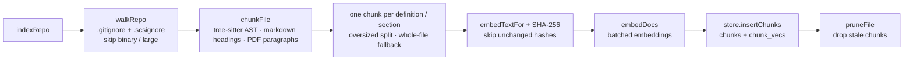

# Semantic Code Search

A super simple MCP/CLI based semantic code/document search tool. Use with any OpenAI compatible endpoint for embedding generation.

Indexes a repo locally into a single file. Chunks code along definition
boundaries (functions, classes, and so on) with tree-sitter, across 16 languages.
Markdown (`.md`) is chunked by heading section and text-based PDFs (`.pdf`) are
chunked into merged paragraphs, so docs are searchable alongside code.

Run it from the command line, or as an MCP server inside Claude Code.

## Getting started

### As an MCP server

Packaged in a Docker container, registering just two MCP tools:

- **`semantic_search`** — natural-language query → ranked `path:line` hits across code and documents. Builds the index automatically on first use, so there's no separate indexing step. Each result reports `lastIndexedAt`.
- **`refresh_index`** — incrementally re-index the current project (code + `.md`/`.pdf` docs) to pick up recent edits. Call it when a search's `lastIndexedAt` predates your changes.

**1. Create `~/.scs.env`** with your embedding backend

```
EMBED_API_KEY=sk-...
EMBED_BASE_URL=https://openrouter.ai/api/v1
EMBED_MODEL=qwen/qwen3-embedding-8b
EMBED_DIMENSIONS=768
EMBED_TOKEN_BUDGET=5000000
```

**2. Register with Claude Code**

```bash
claude mcp add semantic-code-search -- \
  sh -c 'docker run -i --rm \
  --env-file "$HOME/.scs.env" \
  -e CLAUDE_PROJECT_DIR \
  -v scs-index:/data \
  -v "$CLAUDE_PROJECT_DIR":"$CLAUDE_PROJECT_DIR":ro \
  ghcr.io/benjamingehl/semantic-code-search:latest'
```

- `-v scs-index:/data` is a named volume that persists indexes across `--rm`
  runs. Each repo gets its own `<repo>-<hash>.db` inside it (the name is derived
  from `CLAUDE_PROJECT_DIR`), so search results never leak across projects.
- `-v "$CLAUDE_PROJECT_DIR":...:ro` mounts **only the current project,
  read-only, at the same path** — the container sees nothing else on your machine.
- `-e CLAUDE_PROJECT_DIR` forwards the path so the server indexes it and picks
  the matching per-repo `.db`.

Add `--scope user` to register it once for all projects. Then run
`/mcp` in Claude Code to confirm it connects, and ask Claude to search the repo —
the first search builds the index automatically.

_(Prefer to build it yourself? `bun run mcp:build` tags a local image
`scs-mcp:local` — swap that in for the `ghcr.io/...` reference above.)_

### As a CLI

```bash
bun install
```

Configure an embedding backend (see [Configuration](#configuration)) — for a
local server, `EMBED_BASE_URL=http://localhost:8080/v1` and `EMBED_API_KEY=no-key`
is enough. Then:

```bash
bun run index <path>            # build/update the index
bun run search "<query>" [-k N] # search (default k = 20)
```

Install the `scs` command globally with `bun link` (run once from the repo root):

```bash
bun link                        # registers `scs` on your PATH
scs index <path>                # build/update the index
scs search "<query>" [-k N]     # search (default k = 20)
```

`scs` operates on the directory you run it from (the index defaults to
`./code.db`). Run `bun unlink` to remove it.

To run the MCP server directly under Bun for local development (uses your local
`INDEX_DB_PATH`, no Docker):

```bash
bun run mcp
```

## Configuration

| Variable             | Purpose                                                                                                                                          | Default                        |
| -------------------- | ------------------------------------------------------------------------------------------------------------------------------------------------ | ------------------------------ |
| `EMBED_BASE_URL`     | OpenAI-compatible endpoint                                                                                                                       | `https://openrouter.ai/api/v1` |
| `EMBED_API_KEY`      | API key (`no-key` for local servers)                                                                                                             | `no-key`                       |
| `EMBED_MODEL`        | Model id/slug                                                                                                                                    | `qwen/qwen3-embedding-8b`      |
| `EMBED_DIMENSIONS`   | Output dimension (fixed at index creation)                                                                                                       | `768`                          |
| `EMBED_DOC_PREFIX`   | Prefix prepended to documents                                                                                                                    | unset                          |
| `EMBED_QUERY_PREFIX` | Prefix prepended to queries                                                                                                                      | unset                          |
| `EMBED_BATCH_SIZE`   | Documents per embed request                                                                                                                      | `64`                           |
| `EMBED_TOKEN_BUDGET` | Max estimated tokens per index run (`chars/4`, checked before any API call); the run aborts without storing anything if the estimate exceeds it. | `5 000 000`                    |
| `INDEX_DB_PATH`      | Explicit path to the `.db` file (overrides `INDEX_DB_DIR`)                                                                                       | `./code.db`                    |
| `INDEX_DB_DIR`       | Directory holding one `.db` per repo, named from `CLAUDE_PROJECT_DIR`                                                                            | unset                          |

`EMBED_DIMENSIONS` is recorded in the index when it's first created and validated
on every open — change it and you'll be told to re-index. Some models expect
task prefixes (e.g. `search_document: ` / `search_query: `); set them via
`EMBED_DOC_PREFIX` and `EMBED_QUERY_PREFIX`.

## Codebase & dependencies

~780 lines of TypeScript across 14 files (`src/` + `mcp/`), plus 5 test suites
(~545 lines). One `.db` file per repo; no daemon, no external index.

| Package                     | Role in this project                                             |
| --------------------------- | ---------------------------------------------------------------- |
| `web-tree-sitter`           | Parses source into an AST for definition-aware chunking          |
| `tree-sitter-wasms`         | Pre-compiled grammars (16 language WASMs) loaded at runtime      |
| `sqlite-vec`                | `vec0` virtual table — stores embeddings, does cosine-KNN search |
| `openai`                    | Client for the OpenAI-compatible `/v1/embeddings` endpoint       |
| `@modelcontextprotocol/sdk` | Exposes `semantic_search` / `refresh_index` as MCP tools         |
| `ignore`                    | Applies `.gitignore` / `.scsignore` rules during the repo walk   |
| `unpdf`                     | Extracts text from PDFs (pure JS, no native deps)                |
| `@sinclair/typebox`         | Single source for output types + MCP tool JSON Schemas           |

Runs on Bun with `bun:sqlite` (no native better-sqlite3 addon). AST chunking
covers 16 grammars: TypeScript/TSX, JavaScript, Python, Go, Rust, Java, C, C++,
C#, Ruby, PHP, Kotlin, Swift, Scala, Bash. Markdown is split by heading and
text-based PDFs by paragraph; other unknown or unparseable files fall back to a
single whole-file chunk.

## Architecture

The pipeline is **walk → chunk → embed → store**, with search reusing the same
embedder against the stored vectors.

### Indexing



### Search


### Modules

| Path                      | Responsibility                                                      |
| ------------------------- | ------------------------------------------------------------------- |
| `src/walk.ts`             | Recursive repo walk; `.gitignore`/`.scsignore`, binary & size skips |
| `src/chunker/grammars.ts` | Extension → language; loads & caches tree-sitter grammars           |
| `src/chunker/queries.ts`  | Language-agnostic definition detection + name resolution            |
| `src/chunker/index.ts`    | `chunkFile` — AST → chunks; oversized split; whole-file fallback    |
| `src/embedder.ts`         | OpenAI-compatible client; doc/query prefixes; batching              |
| `src/store.ts`            | `bun:sqlite` + sqlite-vec; schema, insert/prune, cosine-KNN         |
| `src/indexer.ts`          | `indexRepo` — orchestrates walk → chunk → embed → store             |
| `src/search.ts`           | `search` — query → embed → store KNN                                |
| `src/config.ts`           | Env parsing; per-repo `.db` naming from `CLAUDE_PROJECT_DIR`        |
| `src/cli.ts`              | `scs index` / `scs search` entry point                              |
| `mcp/server.ts`           | MCP server exposing `semantic_search` / `refresh_index`             |

## Ignoring files

Indexing skips common build/dependency directories by default (`.git`,
`node_modules`, `dist`, …) and honors the repo's `.gitignore`. Add a `.scsignore`
at the repo root (same syntax as `.gitignore`) to exclude more paths; its
patterns apply **on top of** `.gitignore`, so a negation such as `!keep.gen.ts`
can re-include a file `.gitignore` excluded.

## Developer guide

### Prerequisites

- **Bun** (`bun install` to set up). The code is TypeScript on Bun throughout.
- **macOS only:** `bun:sqlite` uses the system SQLite, which can't load
  extensions. Install one that can:

  ```bash
  brew install sqlite
  ```

  `store.ts` defaults to the Apple-Silicon Homebrew SQLite
  (`/opt/homebrew/opt/sqlite/lib/libsqlite3.dylib`); if yours lives elsewhere
  (Intel Homebrew, a custom build, etc.), point `SQLITE_LIB_PATH` at a
  `libsqlite3.dylib` built with dynamic-extension support. Linux loads the
  `sqlite-vec` extension natively — no setup needed.

### Commands

```bash
bun test                # run the test suite
bun run mcp             # run the MCP server locally under Bun
bun run eslint          # lint + autofix
bun run prettier        # format
```
